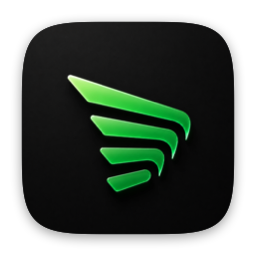
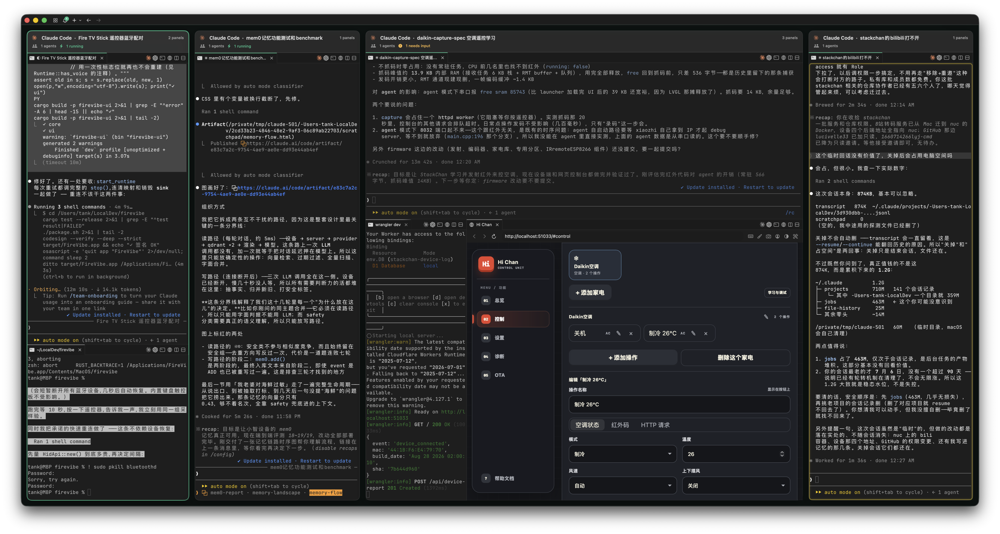
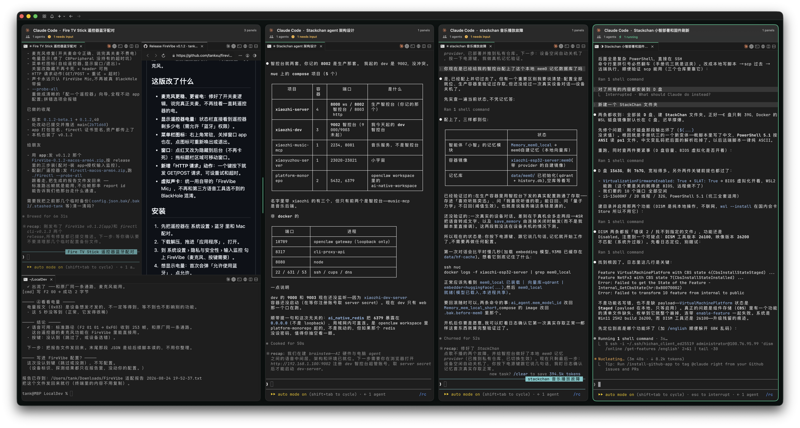

<p align="center">
  
</p>

<h1 align="center">Fleet</h1>
<p align="center">Fleet（舰队）—— 原生 macOS 终端，每个工作区都是同一块看板上的实时卡片</p>

<p align="center">
  <a href="README.md">English</a> | 简体中文
</p>

<p align="center">
  <a href="https://github.com/tankxu/fleet/releases/latest"></a>
  <a href="#许可"></a>
  
</p>

<p align="center">
  
</p>

## 这是什么

Fleet（中文名「舰队」）是 [cmux](https://github.com/manaflow-ai/cmux) 的一个 fork。
cmux 是一个为「跑编码 agent」而做的原生 macOS 终端 —— 用 Swift 和 AppKit 写的，不是
Electron，终端内核是 [Ghostty](https://ghostty.org)。

Fleet 保留了 cmux 的全部能力，并加上一块**画布**：不再是一个工作区占满窗口、其余的排在
侧边栏里等着，而是每个工作区都成为同一块看板上的一张实时卡片。它与 cmux 并存安装，不会
替换它。

### 从 cmux 继承来的

它以**工作区**（一个目录，加上开在它上面的若干终端）来组织工作，整个 app 都是围绕
「打字的是 agent」这件事设计的：

- **通知边框。** agent 需要你时，面板会亮起边框、标签页跟着高亮。通知面板把所有待处理的
  集中在一处，可以直接跳到最近一条未读。
- **带上下文的竖向标签页。** 侧边栏显示 git 分支、关联 PR 的编号与状态、工作目录、正在
  监听的端口，以及最新一条通知的内容。支持横向和纵向分割。
- **可脚本化的内置浏览器。** 在终端旁边分出一个浏览器，并用脚本驱动它 —— 这套 API 移植自
  [agent-browser](https://github.com/vercel-labs/agent-browser)。还能从 Chrome、Firefox、
  Arc 等 20 多种浏览器导入 cookie、历史和会话，所以浏览器面板一开就是已登录状态。
- **SSH 工作区。** `fleet ssh user@remote` 直接为远程机器开一个工作区。浏览器面板走远程
  机器的网络，所以 localhost 就是通的；把图片拖进远程会话会自动用 scp 上传。
- **Claude Code Teams。** `fleet claude-teams` 一条命令跑起 Claude Code 的 teammate 模式，
  队友会以原生分割面板的形式出现，各自带侧边栏信息和通知 —— 不需要 tmux。
- **可编程。** CLI 和 socket API 可以创建工作区、分割面板、发送按键、自动化浏览器；还可以
  在 `cmux.json` 里定义项目专属命令，从命令面板里启动。
- **会话恢复。** 重开 app，工作区都还在。

## 下载

到 [**Releases**](https://github.com/tankxu/fleet/releases/latest) 下载最新构建，解压后把
`Fleet.app` 拖进 `/Applications`。

构建是 ad-hoc 签名、未经公证的，所以 macOS 首次启动时会拦下它。清一次隔离属性即可：

```bash
xattr -dr com.apple.quarantine /Applications/Fleet.app
```

然后正常打开。通用二进制，Apple 芯片和 Intel 都能跑。

Fleet 有自己独立于上游的版本号：当前是 Fleet 0.1.0，基于 cmux 0.64.22 构建。
每个 release 都会写明它所基于的上游版本。

想让 `fleet` 命令进 `PATH`，装好后再链一下：

```bash
ln -sf /Applications/Fleet.app/Contents/Resources/bin/fleet ~/bin/fleet
```

## 画布

<p align="center">
  
</p>

窗口里每个工作区都是一张卡片，而每张卡片都是真正的终端 —— 不是预览图，也不是缩略图。
工作区里有什么，卡片就跑什么：一个 shell、一个 Claude Code 或 Codex 会话、分割的面板、
内置浏览器。它的用途就是同时跑多个 agent，并且不用来回切标签页就能全部看见。

**卡片是组队，不是二分。** 布局是 N 元树：一个容器可以有任意多个成员，所以三个工作区能等宽
并列，而不会退化成层层嵌套的二分。把一张卡片拖到另一张旁边，不会被迫变成 1/2 分割。

**落点按位置判断意图。** 拖进卡片内部 = 与它组队；落在两张卡片之间的缝隙、或一行的首尾 =
平级插入。按住 Shift 可多选，右键菜单里的 **Group workspace** / **Exit group** 与拖拽完全
等效，用于拖拽不好使的场合。

**卡片不会乱动。** 按比例调整尺寸并记住比例，也不会因为某个会话忙起来就自己换位置。你排好的
看板会一直保持那个样子。

**标题说人话。** 单个终端显示路径；跑着 agent 时显示 agent 与会话标题，并换成该 agent 的图标；
一张卡片里有多个终端则显示共同路径。

**就地重命名，右键关闭。** 点卡片标题就能直接改名，也可以用右键菜单里的
**Rename Workspace…**；你手动起的名字不会再被自动标题覆盖。**Close Workspace** 在同一个
菜单里。菜单只挂在卡片标题栏上 —— 卡片主体是终端，在终端里右键该归终端自己管。

## 更小的改动

**会话跑完时的黄色脉冲。** agent 一停下来、需要你了，它的工作区就开始黄色脉冲闪烁。
上游用的是常亮边框，看板上十几张卡片时很容易漏掉，闪烁则不会。遵循系统的
「减弱动态效果」设置。

**Claude 和 Codex 一键可达。** 每个面板的标签栏上都有 Claude 和 Codex 按钮，直接在该面板
自己的工作目录里把 agent 起起来 —— 不用 `cd`，也不用敲命令。终端空闲时命令直接进当前终端；
正忙时会在旁边新开一个 pane，所以点一下绝不会打断正在跑的会话。新建终端、新建浏览器和两个
分割方向也在同一排，整排按钮都可以在 `cmux.json` 里配置。

**统一的主题色。** 主题强调色（绿色）取代了散落各处的 `Color.accentColor`，包括标签栏的装饰色 ——
它此前跟随 macOS 系统强调色，而不是 app 自己的主题。

**只有一个光标在闪。** Ghostty surface 会沿用创建时的 focus 意图，所以从未获得过 first
responder 的 pane 不会再一直对着你闪实心光标。

## 独立身份

Fleet 的 Release 构建是 `com.tankxu.fleet`，因此它与 cmux 并存安装、而非替换。状态数据
按这个身份隔离 —— `~/.config/fleet/fleet.json` 和 `~/Library/Application Support/fleet/` ——
因为两个 app 共用同一份 session 快照文件会互相覆盖工作区。已有的 cmux 安装完全不受影响。

目录名是从运行时的 bundle id 派生的，而不是编译期写死，所以 Debug 与 nightly 构建仍然读取
它们原本的 `cmux` 状态。

仓库内的 `.cmux/` 项目配置目录**故意保持不变**：那是与 cmux 共享的仓库内约定，改名会让
cmux 读不了这些配置。

## 从源码构建

```bash
./scripts/setup.sh          # 子模块 + GhosttyKit
./scripts/install-fleet.sh  # 构建 Release，安装到 /Applications/Fleet.app
```

它同时会在 `~/bin` 装一个 `fleet` 命令。在 Fleet 或 cmux 的终端里，它指向拥有该终端的那个
app；在别处则指向 Fleet。已有的 `cmux` 命令不会被改动。

构建使用本地签名，与本项目一直在用的 Debug 构建相同。设置
`FLEET_DEVELOPMENT_TEAM=<team-id>` 可改用真实证书签名 —— 注意那条路会在该团队下注册
`com.tankxu.fleet` 这个 App ID。

## 已知限制

- **登录目前走不通。** Fleet 注册 `fleet://` 作为回调 scheme，因为两个已安装的 app 都声明
  `cmux://` 时，macOS 可能把回调交给错的那一个。服务端的 scheme 白名单需要部署 `fleet`
  之后登录才能完成，临时办法是 `CMUX_AUTH_CALLBACK_SCHEME=cmux`。纯本地使用 —— 终端、
  工作区、分割、画布 —— 完全不需要账号；登录只影响手机配对、云端工作区和同步。
- **发布的构建未经公证。** 这个 fork 背后没有 Developer ID 证书，所以才有上面那步 `xattr`。
  也没有自动更新。
- **iOS app 仍然是 cmux。** 给它改名需要 Apple Developer 的 App ID、APNs key，以及后端推送
  路由的改动。
- **内部标识符仍然是 `com.cmuxterm`** —— logger subsystem、dispatch queue label、通知名。
  它们不面向用户，而改写其中 225 处纯属折腾，且很容易打错字。

## 其余部分

上面列出的能力全部原样继承，这些内容以上游为准：

- [cmux README](https://github.com/manaflow-ai/cmux/blob/main/README.md) —— 功能与键盘快捷键
- [cmux 文档](https://cmux.com/docs/getting-started) —— 配置说明

若本 fork 与那些文档在名称或颜色上有出入，那是本 fork 改动过的地方。

Fleet 是个人 fork，与 Manaflow, Inc. 无关，也未获其背书。如果你想要的是有人维护、正式签名与
公证、有官方下载的那个，请用 [cmux](https://github.com/manaflow-ai/cmux)。

## 许可

GPL-3.0-or-later，与上游相同。Copyright (c) 2024-present Manaflow, Inc.；
其他贡献者与第三方保留其材料的著作权。本 fork 的改动以相同许可提供。
见 [LICENSE](LICENSE) 与 [THIRD_PARTY_LICENSES.md](THIRD_PARTY_LICENSES.md)。
